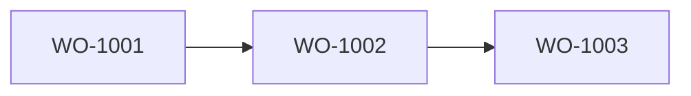

# Production Schedule Reflow

TypeScript implementation of a production schedule reflow engine for the Naologic backend technical test.

## What This Solves

Given work orders, work centers, and dependencies, the reflow service creates an updated valid schedule while enforcing:

- Dependency completion (`all parents must finish before child starts`)
- One active order at a time per work center
- Shift-only work execution (pause/resume outside shift)
- Maintenance window blocking
- Fixed maintenance work orders (`isMaintenance = true`) remain unchanged

## Assumptions and Scope

- Work orders remain assigned to their original work center.
- Work-center reassignment is outside the scope of this implementation.

## Project Structure

```text
.
├── README.md
├── BE-technical-test.md
├── package.json
├── tsconfig.json
├── src/
│   ├── index.ts                     # Runner with sample scenarios
│   ├── reflow/
│   │   ├── reflow.service.ts        # Main algorithm
│   │   ├── dependency-dag.ts        # DAG model + topological sort
│   │   ├── constraint-checker.ts    # Cycle, dependency, and overlap checks
│   │   ├── reflow.service.test.ts   # Unit tests for scheduler behavior
│   │   ├── dependency-dag.test.ts   # Unit tests for DAG behavior
│   │   └── types.ts                 # Core document/result types
│   ├── sample-data/
│   │   └── scenarios.ts             # 5 runnable sample scenarios
│   └── utils/
│       └── date-utils.ts            # Shift + maintenance aware date helpers
└── dist/                            # Build output (generated)
```

## Run

```bash
npm install
npm run dev
npm test
```

Build production JS:

```bash
npm run build
npm start
```

## Scenarios Included

1. `Delay Cascade`
- Early order has longer runtime than planned
- Downstream dependent orders get pushed

2. `Shift Boundary`
- Order starts late in shift and must continue next day
- Child order waits for parent completion

3. `Maintenance Conflict`
- Planned maintenance window blocks production time
- Fixed maintenance work order remains immutable

4. `Fan-out Same Work Center`
- One parent unlocks two children on the same machine at the same moment
- Tie-break uses due-date slack first, then falls back to duration/deterministic order

5. `Fan-in Many Parents`
- One child depends on multiple parent orders
- Child starts only after the latest parent is complete

## Requirements Coverage

- Reflow algorithm in TypeScript: implemented in [`src/reflow/reflow.service.ts`](src/reflow/reflow.service.ts)
- Dependency handling (multiple parents + chains): enforced via DAG + validation checks
- Work-center conflict handling (no overlap): validated in constraint checker
- Work-center reassignment: not implemented (out of scope)
- Shift boundary handling (pause/resume): handled in calendar-aware date utilities
- Setup time support: optional `setupTimeMinutes` is included in working-time consumption
- Maintenance window blocking: enforced in scheduling calendar
- Maintenance work-order immutability: fixed orders remain unchanged
- Sample data scenarios (5): Delay Cascade, Shift Boundary, Maintenance Conflict, Fan-out Same Work Center, Fan-in Many Parents
- Bonus DAG implementation: implemented in [`src/reflow/dependency-dag.ts`](src/reflow/dependency-dag.ts)
- Formal unit tests: implemented with Node test runner in `src/reflow/*.test.ts`

## Algorithm Summary

1. Validate dependency graph (cycle/missing dependency checks).
2. Keep maintenance work orders fixed.
3. Topologically sort all work orders, then schedule only movable ones.
4. For each movable order:
- Compute earliest feasible start from:
  - original start date
  - latest dependency completion
  - current work-center sequencing cursor
- Align to first valid working instant in shift and outside blocked windows.
- Calculate completion by consuming `durationMinutes + setupTimeMinutes` across available working intervals.
5. Validate final schedule:
- dependency correctness
- no overlaps per work center

## DAG Dependency Model

Dependency management is implemented as a dedicated DAG in
[`src/reflow/dependency-dag.ts`](src/reflow/dependency-dag.ts).
It provides:

- Missing dependency detection while building the graph
- Cycle detection (`assertAcyclic`)
- Topological ordering with tie-breaking by planned start date, due-date slack, parent duration, cross-work-center unlock (short dependents first), branch workload, and deterministic keys

Example DAG (`Delay Cascade` scenario):



## Notes

- All datetimes are handled in UTC.
- Shift logic supports pause/resume over non-working periods and maintenance windows.
- If no shifts are available in near horizon, service throws with explicit error.

## Next Improvements

- Add impossible schedule detection for malformed shift definitions.
- Add optimization metrics (total delay, utilization, and idle time).
- Add integration tests for larger multi-work-center datasets.
